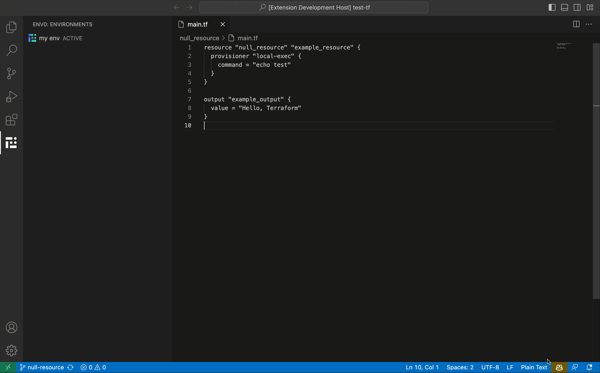
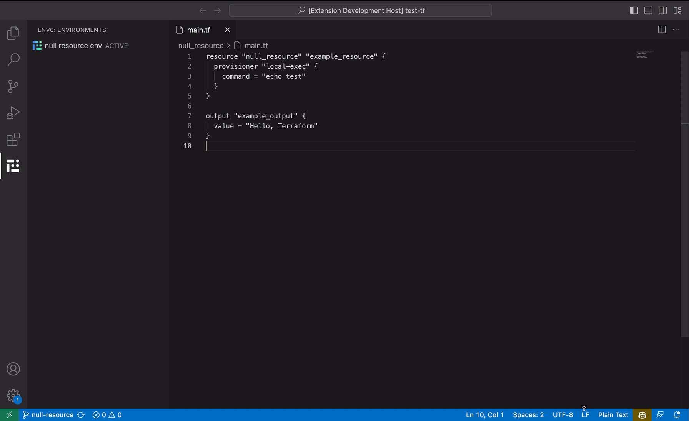

# env0 Extension for Visual Studio Code

Unleash the power of env0 directly from your Visual Studio Code workspace! The env0 extension allows seamless interaction with your env0 environments, making your development process smoother and more efficient.



## 🌟 Features

### View Environments
- Easily access all environments related to the current branch you are working on.

### Execute Actions
- Perform various actions such as `Deploy`, `Destroy`, `Cancel`, and `Abort` without leaving your IDE.

### Real-time Logs
- View the most recent deployment logs in the env0 output channel.

### Notifications
- Stay informed with real-time notifications regarding changing environment statuses and pending approvals.


## 📋 Requirements

Before using this extension, make sure you meet the following prerequisites:

1. **env0 Organization**: You must have an existing env0 organization.
2. **API Credentials**: Provide the API Key ID and API Key Secret during login.

🔗 Learn how to [generate API keys](https://docs.env0.com/docs/api-keys).

## 🔑 Login and Logout

To login or logout, simply use the `env0.login` and `env0.logout` commands through the VS Code command palette (Command / Ctrl + Shift + P).  

## 🌳 Environments View

**Focused Environments View**: The environments view is designed to show you only the environments that are specifically associated with the current branch you're working on, keeping your workflow clean and focused.

## 🚧 Limitations

**Unassociated Environments**: Although env0 allows environments to be created without specifying a branch (automatically associating them with the default branch), **such environments are not displayed in the environments view even if you switch to the default branch**.

**API Key & Organizations**: If you're using a personal API key and your account is associated with multiple organizations, the extension will default to a single organization and won't provide an option to select others.  
Use an Organization API key to resolve this.

## 🛠 Setting Up Your Local Development for Contributing

1. Clone the repository to your local machine.
2. Run `pnpm install` to install the required dependencies.
3. Navigate to the Debug panel, accessible via the shortcut `CMD+SHIFT+D`.
4. From the `RUN AND DEBUG` dropdown menu, select `Run Extension`.
5. If a warning dialog appears, proceed by clicking `Debug Anyway`.

A new VS Code window will now launch, serving as your testing ground for the extension.

### Quick Tips for Development

To refresh your debug window without closing it:
1. Press `CMD+SHIFT+P` to open the command palette.
2. Type `reload` in the search bar.
3. Press Enter to execute.

⚠️ **Note**: Some modifications may necessitate the complete closure of the Debugging IDE.

## 🧪 Testing

### Integration Testing

#### Running the Tests

Execute the following command in your terminal to run the integration tests:
```bash
pnpm run test
```

#### Debugging

For debugging, go to the "Run and Debug" panel in VS Code and select "Extension Test."

#### Libraries Used

- [**@vscode/test-electron**](https://www.npmjs.com/package/@vscode/test-electron): To launch the tests in the VS Code process.
- [**Mocha**](https://www.npmjs.com/package/mocha): Utilized as the test runner.
- [**Expect**](https://www.npmjs.com/package/expect): Used for assertions.
- [**Jest-Mock**](https://www.npmjs.com/package/jest-mock): For mocking, stubbing, and spying on functions.
- [**MSW**](https://www.npmjs.com/package/jest-mock): For HTTP mocking.

#### Testing Adaptations

The VS Code API presents some unique challenges, such as not being able to read the content of notification messages or the VS Code output channel. To navigate these challenges, we use jest-mock to stub these functions, allowing us to verify that our code is behaving correctly during tests.

Moreover, we import the compiled dist extension file into our test setup. This enables us to run specific functions that are part of the extension, such as resetting its state after each test or ensuring that the Tree View displays the appropriate messages.

### Unit Testing

#### Running the Tests

To run the integration tests, execute the following command in your terminal:

```bash
pnpm run unit:test
```

#### Libraries Used

- [**Mocha**](https://www.npmjs.com/package/mocha): This is utilized as the test runner.
- [**Expect**](https://www.npmjs.com/package/expect): This library is used for assertions.
- [**Jest-Mock**](https://www.npmjs.com/package/jest-mock): Employed for mocking, stubbing, and spying on functions.
- [**mock-require**](https://www.npmjs.com/package/mock-require): Used specifically for mocking Visual Studio Code (VSCode).

#### Testing Objectives

Our unit tests are designed to verify the following functionalities:
- Ensuring that user credentials are correctly saved in the VSCode secrets store upon login.
- Confirming that these credentials are deleted when the user logs out.

#### Important Note on Imports

When working with the tests, it is imperative to import the `mocks/vscode` file before importing the file under test. This is because we mock the VSCode import within the `mocks/vscode` file.

#### Test Files

The unit tests are executed on the source TypeScript files, not on the compiled files. We have integrated `ts-node` with Mocha to facilitate the compilation of files during testing.


## 🚀 How to Perform a Release

1. Navigate to the "Actions" tab in the GitHub repository. 
2. Find and select the "Bump Version, Create Tag, and Release" workflow.
3. Click "Run workflow", select the desired `versionBump` option (patch, minor, or major) from the dropdown menu, and initiate the workflow.

The workflow automatically bumps the current version specified in your `package.json` file based on your input. Following this, it creates a new Git tag and releases the new version on GitHub and the Visual Studio Marketplace, all referencing the newly bumped version from the `package.json` file.

### 📚 Recommended Reading

We recommend familiarizing yourself with the following resources:

- [Visual Studio Code's Extension Development Guide](https://code.visualstudio.com/api/extension-guides/overview)
- [Visual Studio Code's Extension User Experience Guidelines](https://code.visualstudio.com/api/ux-guidelines/overview)


**Happy Developing!**
